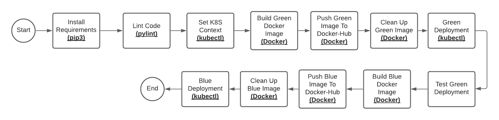

# Udacity Capstone Project 


## Project Steps

1. [Development](#development)
2. [Jenkins](#jenkins)
3. [Setup Kubernetes Cluster](#setup-kubernetes-cluster)
4. [CI/CD Pipeline](#ci/cd-pipeline)

<hr>

### Development

 - Simple flask application.

<hr>

- **Docker Containerization (Local manual check):**

    Run docker flask-app container:

    ```
        $./run_docker.sh
    ```

<br>

- **Push docker image to docker-hub (Local manual check):**

    ```
        $./upload_docker.sh
    ```
<hr>

### Jenkins

- **Create security-group for jenkins:**


- **Create jenkins EC2:**


- **Connect to jenkins ec2:**

```
ssh -i udacity-capstone.pem ubuntu@ec2-18-220-188-146.us-east-2.compute.amazonaws.com
```

- **Setup Jenkins Server:** 

    - Install java:

    ```
    $ sudo apt update && sudo apt install default-jdk;
    ```

    - Install Jenkins.

    - Install pip3 and venv:
        ```
        $ sudo apt install python3-pip
        ```
        ```
        $ sudo apt-get install python3-venv
        ```

    - Install "Blue-Ocean-Aggregator" Plug-In.

    


- **Docker With Jenkins:**

    - Install docker on jenkins server.

    - Add jenkins to docker group:
        ```
        $ sudo usermod -aG docker jenkins
        ```

    - Install "Docker" jenkin's plug-in.

    - Add Docker-Hub credentials to jenkins.

    - Use docker plug-in to build, upload, and delete docker images.


- **AWS With Jenkins:**

    - Install "Pipeline-AWS" Plug-In.
    - Add AWS-User credentials to jenkins.
    

- **Kubernetes With Jenkins:**

    - Install kubectl.

<hr>

### Setup Kubernetes Cluster

Create kubernetes "Production" Cluster on AWS using EKS: (From my local machine)

- Useful resource [here](https://docs.aws.amazon.com/eks/latest/userguide/getting-started-eksctl.html) .

- Install AWS CLI.
- Install eksctl.
- Install kubectl.
- Create Amazon EKS cluster:
    1. Create an AWS IAM service role:

    

    2. Create Network (VPC,Subnets,SecurityGroups,InternetGateway,RouteTables) to deploy the cluster using **CloudFormation/amazon-eks-vpc-sample.yaml**

    

    

    3. Create AWS EKS Cluster:

    

    4. Configure kubectl for Amazon EKS:

    ```
    $ aws eks --region us-east-2 update-kubeconfig --name production
    ```

    ```
    kubectl config current-context
    ```

    

    5. Create worker nodes to join kubernetes cluster using **CloudFormation/amazon-eks-nodegroup.yaml**:

    

    
    

    6. Enable the worker nodes to join cluster using **k8s/aws-auth-cm.yaml**: 

    ```
    kubectl apply -f ~/.kube/aws-auth-cm.yaml
    ```

    check nodes :

    ```
    kubectl get nodes
    ```

    

    
    

    7. Test deploying flask-app on the production cluster outside pipeline:

    ```
    kubectl apply -f k8s/blue-deployment.yaml 
    ```

    ```
    kubectl apply -f k8s/service.yaml 
    ```

    ```
    kubectl get all
    ```

    

    Access the app from browser:

    

<hr>

### CI/CD Pipeline

Overview: 



Steps:

1. Install needed packages from **requirements.txt**.

2. Linting Code:


